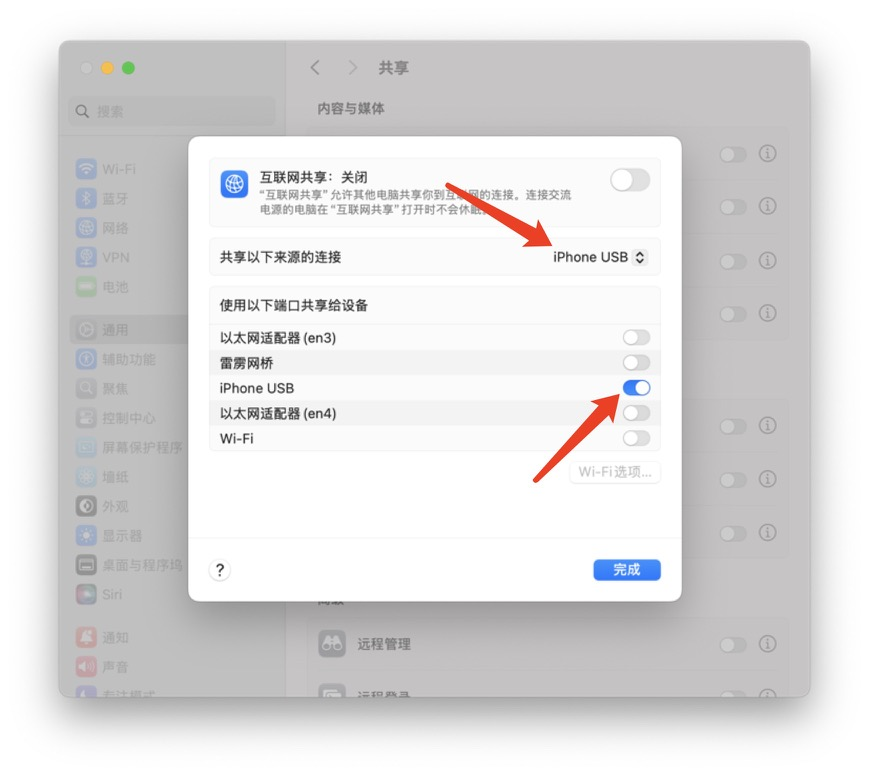

# usb-proxy-dev-server

通过 USB 将 iPhone 连接到 Mac 时，在 Mac 上创建一个可被 iPhone 访问的代理服务器。实现无侵入式的iphone → usb → proxyserver → mac → server的调试链路

## 用途

Mac打开网络共享后，让 iPhone 通过Mac的usb网络ip访问 Mac 上本地运行的服务。并展示Mac的usb网络ip

## 安装

```bash
npm install -g usb-proxy-dev-server
```

## 🚀 使用步骤

### 步骤 1：确保 Mac 与 iPhone 通过 USB 网络共享连接

1. **连接 iPhone 与 Mac**（使用 USB 数据线）。
2. 在 Mac 上打开：
   `系统设置 → 通用 → 共享 → 互联网共享 → iPhone USB`




### 步骤 2：启动你在 Mac 上的本地服务

假设你的服务监听在：

```
http://127.0.0.1:3000
```

---

### 步骤 3：运行代理服务

在终端中运行：

```bash
usb-proxy --localPort=<LOCAL_TARGET_PORT> --proxyPort=<PROXY_PORT>
```

示例：

```bash
usb-proxy --localPort=8082 --proxyPort=7082
```

这表示：将 Mac 本地的 `127.0.0.1:8082` 映射到 `0.0.0.0:7082`，供其他设备访问。

---

### 步骤 4：在 iPhone 上访问你的服务

打开 Safari 或其他浏览器，输入：

```
http://<Mac的USB网络IP>:7082
```

如：

```
http://169.254.92.141:7082
```

即可访问你的本地服务！

---

## 🔧 参数说明

* `<LOCAL_TARGET_PORT>`：你希望代理的本地端口（比如开发服务器监听的端口）
* `<PROXY_PORT>`：你希望监听的代理端口（供 iPhone 访问）

---

## 📌 注意事项

* 请确保本地服务监听在 `127.0.0.1:<LOCAL_TARGET_PORT>`。
* 若被防火墙拦截，请允许 Node.js 的入站连接。
* 若 iPhone 无法访问，请在 Mac 上运行 `ifconfig` 或 `ipconfig getifaddr enX` 查找实际 IP。

---

## 注意事项

- iPhone 必须通过 USB 使用「Internet共享」连接 Mac。
